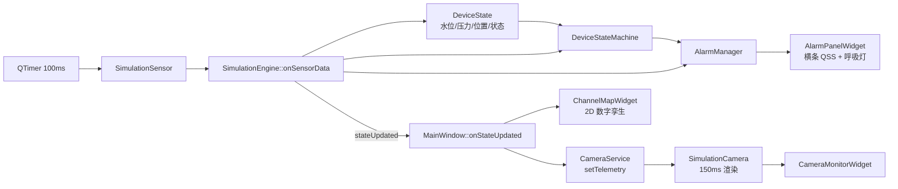

# 渠沟清理标定与数字孪生监控系统

**Ditch Cleaning & Calibration Digital Twin System**

基于 Qt 6 / C++17 的工控级水渠清理机器人上位机标定与数字孪生实时监控平台。系统内置传感器与摄像头仿真、清洗头状态机、多级报警联动、障碍物数据编辑与撤销重做，并通过 2D 数字孪生画布实现轨迹、墙体贴条与柱状图的 1:1 投影映射。

> 本项目完整源码位于本分支的 `ChannelInspectionCalibration/` 子目录，以下内容即该软件的项目说明。


## 项目亮点

- **2D 数字孪生与障碍物 1:1 严密映射**：基于 `QGraphicsView` 实现 0-100m 实时轨迹、混凝土墙体与柱状图的上下精确投影对齐，颜色与里程区间严格统一。
- **状态机与多级呼吸报警**：`DeviceStateMachine` 自动判定设备状态（正常 / 警告 / 破损 / 已停止），动态驱动三色呼吸灯与报警横条 QSS 联动变色。
- **实时视觉监控仿真**：内置 `SimulationCamera` 粒子引擎与 HUD 渲染，以 640x360 @ ~7FPS 生成动态水花、喷水与清洗头画面。
- **数据编辑与 Undo/Redo 历史栈**：障碍物表格支持交互式下拉编辑、增删改，并内置撤销 / 重做栈。
- **面向工业扩展的硬件抽象层**：预留 Serial / CAN / MQTT 接口，解耦模拟引擎与真实硬件，便于后续直接接入现场总线。

## 架构与数据流设计



核心设计说明：

- **单线程事件循环 + 信号槽**：整机运行在 Qt 主线程事件循环内，`QTimer` 驱动模拟传感器与摄像头，各模块通过 signal/slot 解耦。
- **共享状态模型**：`DeviceState` 是跨层共享的唯一状态源，使用 `QMutex` 保护，避免引擎回写与 UI 读取之间的竞态。
- **报警零业务 UI**：`AlarmManager` 独立完成报警评估、历史与确认，UI 只做展示；报警横条与呼吸灯由同一刷新路径同步驱动。
- **数字孪生单一数据源**：墙体贴条与柱状图共用同一障碍物分组与取色函数，保证上下投影 100% 对齐。

## 源码结构

以下结构对应 `ChannelInspectionCalibration/` 子目录：

```text
ChannelInspectionCalibration/
├── main.cpp                    # 程序入口 (QApplication + 全局 QSS)
├── CMakeLists.txt              # 构建配置与源码清单
├── config/DeviceConfig.h       # 全局常量：速度、水压、障碍类型、颜色映射、Z 序
├── models/                     # 核心数据模型 (DeviceState / Obstacle / AlarmEvent / WorkLogEntry)
├── hardware/                   # 硬件接口抽象 (Sensor/Camera 模拟实现，串口/CAN/MQTT 预留扩展)
├── services/                   # 核心业务服务
│   ├── SimulationEngine        # 业务编排：传感器定时取数、状态机评估、报警派发
│   ├── DeviceStateMachine      # 清洗头状态机 (NORMAL → WARNING → DAMAGE → STOPPED)
│   ├── AlarmManager            # 报警逻辑评估、历史队列与确认
│   └── CameraService           # 摄像头调度与帧派发
├── database/AlarmHistoryModel  # 内存表格模型 (AlarmHistory)
├── visualization/ChannelMapWidget # 2D 数字孪生画布 (QGraphicsView 场景绘制)
└── ui/                         # UI 视图层 (MainWindow、报警面板、视觉监控、表格 Model)
```

> `deploy/` 为发布运行时目录（windeployqt 打包产物），`build*/` 为本地 CMake 构建产物，可忽略。

## 构建与编译指南

环境要求：

- Qt 6.8.2（`Core`, `Gui`, `Widgets`, `Network`, `Svg`）
- MinGW（g++ 支持 C++17）
- CMake 3.16+

命令行构建：

```bash
cmake -S . -B build -G "MinGW Makefiles" \
  -DCMAKE_BUILD_TYPE=Release \
  -DCMAKE_PREFIX_PATH=C:/Qt/6.8.2/mingw_64

cmake --build build --parallel 8
```

构建完成后可直接运行 `build/ChannelInspectionCalibration.exe`。如需发布，使用 `windeployqt` 收集 Qt 运行时依赖：

```bash
windeployqt build/ChannelInspectionCalibration.exe
```

## 路线图

- [ ] 接入真实 CAN / MQTT / 串口硬件总线，替换 `SimulationSensor` / `SimulationCamera`
- [ ] PDF 派工单导出落盘
- [ ] SQLite 持久化（报警历史、工作日志、标定记录）
- [ ] 多通道 / 多设备并发监控
- [ ] 远程 Web 监控（MQTT 上云 / Qt WebEngine）

## License

MIT
