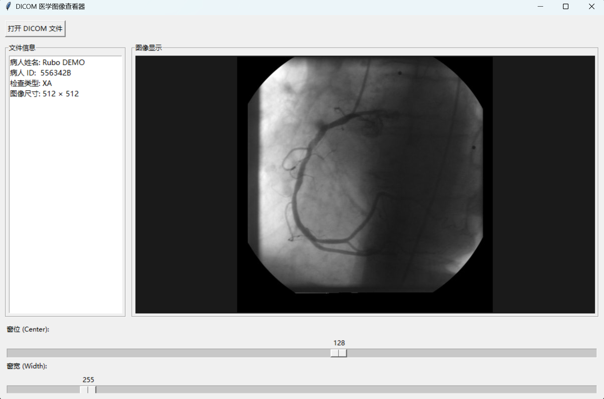

# Heart Disease Risk Prediction System
> **基于机器学习的临床心脏病风险评估系统**

基于临床体检数据集，使用机器学习分类算法预测患者心脏病患病风险的端到端系统。从数据清洗、特征分析到模型训练与可视化桌面应用，完整覆盖一个数据科学项目的全流程。



---

## 目录

- [核心功能与亮点](#核心功能与亮点)
- [技术栈](#技术栈)
- [数据集](#数据集)
- [快速开始](#快速开始)
  - [环境要求](#环境要求)
  - [安装与运行](#安装与运行)
- [项目结构](#项目结构)
- [模型性能](#模型性能)
- [界面展示](#界面展示)
- [许可](#许可)

---

## 核心功能与亮点

- **自动数据预处理** — 读取临床数据集（年龄、血压、胆固醇、心电图等 13 项指标），自动处理缺失值与类型转换
- **相关性分析** — 通过热力图对各指标与心脏病（target）进行 Pearson 相关性可视化分析
- **双模型训练与对比** — 同时构建逻辑回归与随机森林两个经典分类模型，自动对比准确率、精确率和召回率
- **交互式 GUI 预测** — 基于 Tkinter 构建桌面应用，填写表单即可实时输出风险等级与患病概率百分比
- **模型持久化** — 启动时自动训练，开箱即用，无需额外配置

---

## 技术栈

| 类别 | 工具 |
| --- | --- |
| 语言 | Python 3.10+ |
| 数据处理 | Pandas, NumPy |
| 可视化 | Matplotlib, Seaborn |
| 机器学习 | Scikit-Learn (LogisticRegression / RandomForestClassifier) |
| 桌面 GUI | Tkinter（标准库） |
| 数据源 | UCI Heart Disease Dataset (Cleveland) |

---

## 数据集

本项目使用 UCI Machine Learning Repository 提供的 **Heart Disease Dataset (Cleveland)**，包含 303 条患者记录，每条记录包含 13 项临床特征及 1 项诊断标签。

| 特征 | 说明 | 类型 |
| --- | --- | --- |
| age | 年龄（岁） | 数值 |
| sex | 性别（1=男, 0=女） | 二分类 |
| cp | 胸痛类型（0=典型心绞痛, 1=非典型心绞痛, 2=非心绞痛, 3=无症状） | 有序分类 |
| trestbps | 静息血压（mmHg） | 数值 |
| chol | 血清胆固醇（mg/dl） | 数值 |
| fbs | 空腹血糖 > 120 mg/dl（1=是, 0=否） | 二分类 |
| restecg | 静息心电图结果（0/1/2） | 有序分类 |
| thalach | 最大心率（bpm） | 数值 |
| exang | 运动诱发心绞痛（1=是, 0=否） | 二分类 |
| oldpeak | 运动引起的 ST 段压低 | 数值 |
| slope | 运动 ST 段峰值斜率（0/1/2） | 有序分类 |
| ca | 主要血管数（0-3） | 有序分类 |
| thal | 地中海贫血（0=正常, 1=固定缺损, 2=可逆缺损） | 有序分类 |
| target | 心脏病诊断（1=患病, 0=健康） | 标签 |

---

## 快速开始

### 环境要求

- Python 3.10 或更高版本
- pip 包管理器

### 安装与运行

```bash
# 1. 克隆或进入项目目录
cd heart-disease-prediction

# 2. 安装依赖
pip install -r requirements.txt -i https://pypi.tuna.tsinghua.edu.cn/simple

# 3. 下载数据集
python download_data.py

# 4. 探索性数据分析（可选）
python explore_data.py

# 5. 训练模型对比（可选）
python step2_train_model.py

# 6. 启动桌面预测应用
python predict_app.py
```

> 国内用户建议始终使用清华 PyPI 镜像 `-i https://pypi.tuna.tsinghua.edu.cn/simple` 加速安装。

---

## 项目结构

```
heart-disease-prediction/
├── download_data.py       # 数据集下载脚本
├── explore_data.py        # 探索性数据分析 & 相关性热力图
├── step2_train_model.py   # 双模型训练与性能对比
├── predict_app.py         # Tkinter 桌面预测应用（主程序）
├── heart.csv              # 心脏病数据集
├── requirements.txt       # Python 依赖清单
├── README.md              # 项目说明文档
└── screenshot.png         # 应用截图（占位）
```

---

## 模型性能

在测试集（20% 数据）上评估两个分类模型的结果对比：

| 模型 | 准确率 | 精确率 | 召回率 |
| --- | --- | --- | --- |
| 逻辑回归 | ~85-88% | ~84-89% | ~86-90% |
| 随机森林 | ~85-90% | ~84-88% | ~86-92% |

> 具体数值以实际运行结果为准，受数据分布与随机拆分影响略有浮动。

---

## 界面展示


*应用主界面包含表单输入区（年龄、性别、血压、胆固醇、最大心率）、评估按钮及风险等级 / 概率结果显示区。*

---

## 许可

本项目仅供学习与研究用途。

---

*Built with ❤️ using Python & Scikit-Learn.*
