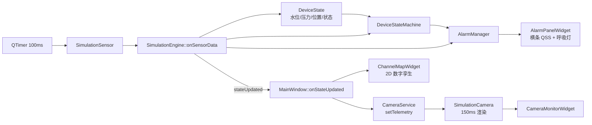

# 渠沟清理标定与数字孪生监控系统
# Ditch Cleaning & Calibration Digital Twin System

基于 Qt 6 / C++17 的工控级水渠清理机器人上位机标定与数字孪生实时监控平台。系统内置传感器与摄像头仿真、清洗头状态机、多级报警联动、障碍物数据编辑与撤销重做，并通过 2D 数字孪生画布实现轨迹、墙体贴条与柱状图的 1:1 投影映射。

An industrial-grade host computer calibration and real-time digital twin monitoring platform for ditch cleaning robots, built with Qt 6 / C++17. It ships with simulated sensors and cameras, a cleaning-head state machine, multi-level alarm linkage, interactive obstacle editing with undo/redo, and a 2D digital twin canvas where wall strips and bar charts are projected with strict 1:1 alignment.

> 本项目完整源码位于本分支的 `ChannelInspectionCalibration/` 子目录，以下内容即该软件的项目说明。
> The complete source code lives in the `ChannelInspectionCalibration/` subdirectory of this branch; the rest of this document describes that project.


---

## 项目背景 / Project Background

水渠与排水沟的清理作业长期依赖人工经验：缺乏统一的标定数据、缺少实时作业监控、报警响应滞后，作业记录也难以归档复用。本系统面向上述场景，提供“标定、仿真、监控、记录”一体化的上位机平台：

- 统一渠道与障碍物标定数据，支撑后续真实硬件接入；
- 以数字孪生画布实时呈现清洗轨迹、障碍物分布与设备状态；
- 状态机自动评估设备健康度，报警横条与呼吸灯同步联动；
- 内置模拟传感器与摄像头，便于离线演示、调参和验收。

Ditch and drainage cleaning has long relied on manual experience: calibration data is inconsistent, real-time monitoring is missing, alarm response lags behind, and job records are hard to reuse. This system provides an all-in-one host platform for calibration, simulation, monitoring and recording:

- Unified channel and obstacle calibration data, ready for real hardware integration;
- A digital twin canvas showing cleaning trajectory, obstacle distribution and device status in real time;
- A state machine that evaluates device health while the alarm bar and breathing light stay in sync;
- Built-in simulated sensors and cameras for offline demos, tuning and acceptance testing.

## 技术栈 / Tech Stack

| 类别 / Category | 技术 / Technology |
| --- | --- |
| 语言与标准 / Language | C++17 |
| GUI 框架 / GUI Framework | Qt 6.8.2（`Core` / `Gui` / `Widgets` / `Network` / `Svg`） |
| 构建系统 / Build | CMake 3.16+（`AUTOMOC` / `AUTORCC` / `AUTOUIC`，Release `-O2`） |
| 编译器 / Compiler | MinGW-w64（g++） |
| 图形绘制 / Graphics | `QGraphicsView` / `QGraphicsScene` / 自定义 `QGraphicsItem` + `QPainter` |
| 动画 / Animation | `QPropertyAnimation` + `QEasingCurve`（呼吸报警灯） |
| 数据模型 / Data Model | `QAbstractTableModel` + `QStyledItemDelegate`（下拉编辑） |
| 状态共享 / Shared State | `QMutex` 保护的 `DeviceState` 单例状态 |
| 数据交换 / Data Exchange | `QJsonDocument` JSON 导入导出 |
| 硬件扩展 / Hardware Extension | `SensorInterface` / `CameraInterface`，预留 Serial / CAN / MQTT |

## 项目亮点 / Key Features

- **2D 数字孪生与障碍物 1:1 严密映射**：基于 `QGraphicsView` 实现 0-100m 实时轨迹、混凝土墙体与柱状图的上下精确投影对齐，颜色与里程区间严格统一。
  **Strict 1:1 digital twin mapping**: real-time 0-100m trajectory, concrete wall strips and obstacle bar charts are projected with identical colors and mileage ranges.
- **状态机与多级呼吸报警**：`DeviceStateMachine` 自动判定设备状态（正常 / 警告 / 破损 / 已停止），动态驱动三色呼吸灯与报警横条 QSS 联动变色。
  **State machine + multi-level breathing alarm**: device health transitions automatically and drives the three-color breathing light and alarm bar QSS in sync.
- **实时视觉监控仿真**：内置 `SimulationCamera` 粒子引擎与 HUD 渲染，以 640x360 @ ~7FPS 生成动态水花、喷水与清洗头画面。
  **Real-time vision simulation**: built-in particle engine and HUD rendering produce dynamic spray and cleaning-head footage at 640x360, ~7 FPS.
- **数据编辑与 Undo/Redo 历史栈**：障碍物表格支持交互式下拉编辑、增删改，并内置撤销 / 重做栈。
  **Editing with undo/redo**: the obstacle table supports dropdown editing, add/delete, and a built-in undo/redo stack.
- **面向工业扩展的硬件抽象层**：预留 Serial / CAN / MQTT 接口，解耦模拟引擎与真实硬件，便于后续直接接入现场总线。
  **Hardware abstraction for industrial expansion**: Serial / CAN / MQTT interfaces are reserved, decoupling the simulation engine from real hardware.

## 架构与数据流 / Architecture & Data Flow



核心设计说明 / Design notes:

- **单线程事件循环 + 信号槽**：整机运行在 Qt 主线程事件循环内，`QTimer` 驱动模拟传感器与摄像头，各模块通过 signal/slot 解耦。
  **Single-threaded event loop + signals/slots**: everything runs inside the Qt main thread; `QTimer` drives the simulated sensor and camera, and modules communicate through signals and slots.
- **共享状态模型**：`DeviceState` 是跨层共享的唯一状态源，使用 `QMutex` 保护，避免引擎回写与 UI 读取之间的竞态。
  **Shared state model**: `DeviceState` is the single source of truth protected by `QMutex` to avoid races between engine writes and UI reads.
- **报警零业务 UI**：`AlarmManager` 独立完成报警评估、历史与确认，UI 只做展示；报警横条与呼吸灯由同一刷新路径同步驱动。
  **Zero business logic in alarm UI**: `AlarmManager` owns evaluation, history and acknowledgment; the alarm bar and breathing light are driven by the same refresh path.
- **数字孪生单一数据源**：墙体贴条与柱状图共用同一障碍物分组与取色函数，保证上下投影 100% 对齐。
  **Single source of truth for the digital twin**: wall strips and bar charts share the same obstacle grouping and color mapping, guaranteeing 100% projection alignment.

## 源码结构 / Directory Structure

以下结构对应 `ChannelInspectionCalibration/` 子目录 / The tree below maps to the `ChannelInspectionCalibration/` subdirectory:

```text
ChannelInspectionCalibration/
├── main.cpp                    # 程序入口 (QApplication + 全局 QSS)
├── CMakeLists.txt              # 构建配置与源码清单
├── config/DeviceConfig.h       # 全局常量：速度、水压、障碍类型、颜色映射、Z 序
├── models/                     # 核心数据模型 (DeviceState / Obstacle / AlarmEvent / WorkLogEntry)
├── hardware/                   # 硬件接口抽象 (Sensor/Camera 模拟实现，串口/CAN/MQTT 预留扩展)
├── services/                   # 核心业务服务
│   ├── SimulationEngine        # 业务编排：传感器定时取数、状态机评估、报警派发
│   ├── DeviceStateMachine      # 清洗头状态机 (NORMAL → WARNING → DAMAGE → STOPPED)
│   ├── AlarmManager            # 报警逻辑评估、历史队列与确认
│   └── CameraService           # 摄像头调度与帧派发
├── database/AlarmHistoryModel  # 内存表格模型 (AlarmHistory)
├── visualization/ChannelMapWidget # 2D 数字孪生画布 (QGraphicsView 场景绘制)
└── ui/                         # UI 视图层 (MainWindow、报警面板、视觉监控、表格 Model)
```

## 安装步骤 / Installation

环境要求 / Prerequisites:

- Windows 10/11（64 位）
- Qt 6.8.2（MinGW 64-bit 套件，含 `Core` / `Gui` / `Widgets` / `Network` / `Svg`）
- MinGW-w64（g++ 支持 C++17）
- CMake 3.16+

安装步骤 / Steps:

1. 安装 Qt 6.8.2，选择 MinGW 64-bit 套件，并记录 Qt 安装路径（例如 `C:/Qt/6.8.2/mingw_64`）。
   Install Qt 6.8.2 with the MinGW 64-bit kit and note the installation path (e.g. `C:/Qt/6.8.2/mingw_64`).
2. 安装 CMake，并确保 `cmake`、`g++`、`mingw32-make` 已加入系统 PATH。
   Install CMake and make sure `cmake`, `g++` and `mingw32-make` are available in `PATH`.
3. 获取源码（本仓库的 `docs/ditch-cleaning-readme` 分支）：
   Clone the source from this repository (branch `docs/ditch-cleaning-readme`):

   ```bash
   git clone -b docs/ditch-cleaning-readme \
     https://github.com/ouzekai666-cpu/psychic-octo-guacamole.git
   cd psychic-octo-guacamole/ChannelInspectionCalibration
   ```

## 运行指南 / Run Guide

配置与构建 / Configure and build:

```bash
cmake -S . -B build -G "MinGW Makefiles" \
  -DCMAKE_BUILD_TYPE=Release \
  -DCMAKE_PREFIX_PATH=C:/Qt/6.8.2/mingw_64

cmake --build build --parallel 8
```

运行 / Run:

```bash
./build/ChannelInspectionCalibration.exe
```

发布打包（可选）/ Package for distribution (optional):

```bash
windeployqt build/ChannelInspectionCalibration.exe
```

基本操作流程 / Typical workflow:

1. 在左侧栏填写渠道编号、长度、操作员与检查日期；
   Fill in channel ID, length, operator and inspection date in the sidebar.
2. 可点击“随机生成新现场”或直接在障碍物表格中编辑障碍数据；
   Click “随机生成新现场” or edit obstacle data directly in the table.
3. 点击“开始模拟”，观察数字孪生轨迹、水箱液位、报警中心与视觉监控；
   Click “开始模拟” to watch the digital twin, water level, alarm center and camera monitor.
4. 模拟结束后点击“导出标定数据”保存 JSON 标定结果。
   Click “导出标定数据” after the run to save calibration data as JSON.

## 路线图 / Roadmap

- [ ] 接入真实 CAN / MQTT / 串口硬件总线，替换 `SimulationSensor` / `SimulationCamera`
  Integrate real CAN / MQTT / serial hardware, replacing the simulated sensor and camera.
- [ ] PDF 派工单导出落盘
  Export work orders as PDF files.
- [ ] SQLite 持久化（报警历史、工作日志、标定记录）
  Persist alarm history, work logs and calibration records with SQLite.
- [ ] 多通道 / 多设备并发监控
  Support multi-channel / multi-device concurrent monitoring.
- [ ] 远程 Web 监控（MQTT 上云 / Qt WebEngine）
  Remote web monitoring via MQTT cloud or Qt WebEngine.

## License

MIT
